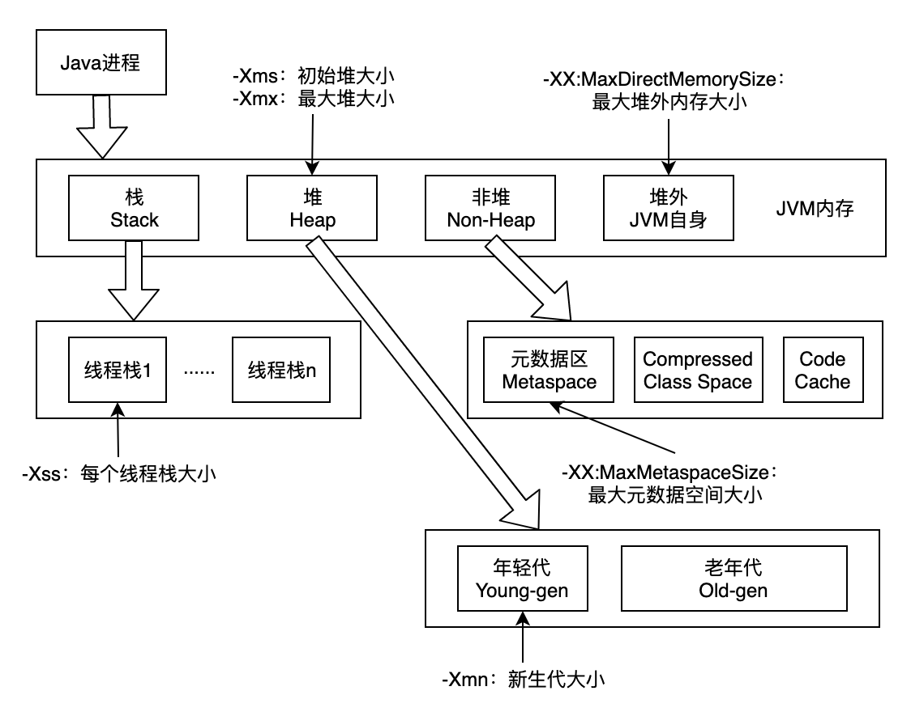

# 第一周作业

## 作业题目

1.（选做）自己写一个简单的 Hello.java，里面需要涉及基本类型，四则运行，if 和 for，然后自己分析一下对应的字节码，有问题群里讨论。

2.（必做）自定义一个 Classloader，加载一个 Hello.xlass 文件，执行 hello 方法，此文件内容是一个 Hello.class 文件所有字节（x=255-x）处理后的文件。文件群里提供。

3.（必做）画一张图，展示 Xmx、Xms、Xmn、Meta、DirectMemory、Xss 这些内存参数的关系。

4.（选做）检查一下自己维护的业务系统的 JVM 参数配置，用 jstat 和 jstack、jmap 查看一下详情，并且自己独立分析一下大概情况，思考有没有不合理的地方，如何改进。

注意：如果没有线上系统，可以自己 run 一个 web/java 项目。

5.（选做）本机使用 G1 GC 启动一个程序，仿照课上案例分析一下 JVM 情况。

## 作业完成说明

### 作业1

Hello.java代码如下：

> https://github.com/piercebn/JavaCourse/blob/main/01jvm/java-cource/src/main/java/com/piercebn/javacource/jvm/Hello.java

```java
public class Hello {
    public static void main(String[] args) {
        int num1 = 1;       // 字面量1;
        double num2 = 2.0D; // 大小写的D都可以
        long num3 = 3L;     // 大小写的L都可以, 加L是好习惯;
        byte num4 = 4;      // 可以直接赋予 [-128, 127] 范围内的字面量;
        if ("".length() < 10) {
            // 错误用法: num2 + num3 = 2.03
            System.out.println("错误用法: num2 + num3 = " + num2 + num3);
        }
        for (int i = 0; i < num1; i++) {
            // 四则运算: num1 * num4 = 4
            System.out.print("四则运算: num1 * num4 = ");
            System.out.println(num1 * num4);
        }
    }
}
```

字节码分析如下：

```java
Compiled from "Hello.java"
public class com.piercebn.javacource.jvm.Hello {
  public com.piercebn.javacource.jvm.Hello();  // 默认无参构造函数
    Code:                                   // stack=1, locals=1, args_size=1
       0: aload_0                           // 加载本地变量表位置0的变量加载到栈上，类型为类Hello引用，栈指针1
       1: invokespecial #1                  // 调用父类构造函数，栈指针0，常量池#1 Method java/lang/Object."<init>":()V
       4: return

  public static void main(java.lang.String[]); // 静态main方法
    Code:                                   // stack=4, locals=8, args_size=1
       0: iconst_1                          // 常量1入栈，类型为int，栈指针1
       1: istore_1                          // 将栈int类型数据存入变量表位置1，栈指针0
       2: ldc2_w        #2                  // double 2.0d，常量#2 2.0d入栈，类型为double，栈指针2
       5: dstore_2                          // 将栈double类型数据存入变量表位置2，栈指针0
       6: ldc2_w        #4                  // long 3l，常量#4 3l入栈，类型为long，栈指针2
       9: lstore        4                   // 将栈long类型数据存入变量表位置4，栈指针0
      11: iconst_4                          // 常量4入栈，类型为int，栈指针1
      12: istore        6                   // 将栈int类型数据存入变量表位置6，栈指针0
      14: ldc           #6                  // String，常量#6 “”入栈，类型为String，栈指针1
      16: invokevirtual #7                  // 调用虚拟方法，结果0入栈，栈指针1，常量池#7 Method java/lang/String.length:()I
      19: bipush        10                  // 常量10入栈，类型为int，栈指针2
      21: if_icmpge     54                  // 字符串长度0 < 10继续执行下调指令，否则跳转到54执行，栈指针0
      24: getstatic     #8                  // 加载静态成员System.out，栈指针1，常量池#8 Field java/lang/System.out:Ljava/io/PrintStream;
      27: new           #9                  // new对象#9 class java/lang/StringBuilder
      30: dup                               // 对象入栈，栈指针2
      31: invokespecial #10                 // 调用构造函数，常量池#10 Method java/lang/StringBuilder."<init>":()V
      34: ldc           #11                 // String 错误用法: num2 + num3 =，常量#11入栈，类型为String，栈指针3
      36: invokevirtual #12                 // 调用虚拟方法追加String，栈指针2，常量池#12 Method java/lang/StringBuilder.append:(Ljava/lang/String;)Ljava/lang/StringBuilder;
      39: dload_2                           // 加载变量表位置2数据入栈，类型double，栈指针4
      40: invokevirtual #13                 // 调用虚拟方法追加double，栈指针2，常量池#13 Method java/lang/StringBuilder.append:(D)Ljava/lang/StringBuilder;
      43: lload         4                   // 加载变量表位置4数据入栈，类型long，栈指针4
      45: invokevirtual #14                 // 调用虚拟方法追加long，栈指针2，常量池#14 Method java/lang/StringBuilder.append:(J)Ljava/lang/StringBuilder;
      48: invokevirtual #15                 // 调用虚拟方法转换String入栈，栈指针2，常量池#15 Method java/lang/StringBuilder.toString:()Ljava/lang/String;
      51: invokevirtual #16                 // 调用虚拟方法打印String，栈指针0，常量池#16 Method java/io/PrintStream.println:(Ljava/lang/String;)V
      54: iconst_0                          // 常量0入栈，类型为int，栈指针1
      55: istore        7                   // 将栈int类型数据存入变量表位置7，栈指针0
      57: iload         7                   // 加载变量表位置7数据入栈，类型int，栈指针1
      59: iload_1                           // 加载变量表位置1数据入栈，类型int，栈指针2
      60: if_icmpge     87                  // 0 < 1继续执行下调指令，否则跳转到87执行，栈指针0
      63: getstatic     #8                  // 加载静态成员System.out，栈指针1，常量池#8 Field java/lang/System.out:Ljava/io/PrintStream;
      66: ldc           #17                 // String 四则运算: num1 * num4 =，常量#17入栈，类型为String，栈指针2
      68: invokevirtual #18                 // 调用虚拟方法打印String，栈指针0，常量池#18 Method java/io/PrintStream.print:(Ljava/lang/String;)V
      71: getstatic     #8                  // 加载静态成员System.out，栈指针1，常量池#8 Field java/lang/System.out:Ljava/io/PrintStream;
      74: iload_1                           // 加载变量表位置1数据入栈，类型int，栈指针2
      75: iload         6                   // 加载变量表位置6数据入栈，类型int，栈指针3
      77: imul                              // 乘法运算结果入栈，类型int，栈指针2
      78: invokevirtual #19                 // 调用虚拟方法打印int，栈指针0，常量池#19 Method java/io/PrintStream.println:(I)V
      81: iinc          7, 1                // int类型变量表7位置的变量自增1，自增后数值为1
      84: goto          57                  // 跳转57执行
      87: return
}
```

### 作业2

自定义 Classloader代码如下：

> https://github.com/piercebn/JavaCourse/blob/main/01jvm/java-cource/src/main/java/com/piercebn/javacource/jvm/XlassLoader.java

### 作业3

Xmx、Xms、Xmn、Meta、DirectMemory、Xss 内存参数关系图如下：




### 作业4

检查JVM参数配置及相关堆和栈信息

jinfo

> jinfo 24963

```java
java.runtime.name = Java(TM) SE Runtime Environment
java.vm.version = 25.281-b09
sun.boot.library.path = /usr/java/jdk1.8.0_281-amd64/jre/lib/amd64
java.protocol.handler.pkgs = org.springframework.boot.loader
java.vendor.url = http://java.oracle.com/
java.vm.vendor = Oracle Corporation
path.separator = :
file.encoding.pkg = sun.io
java.vm.name = Java HotSpot(TM) 64-Bit Server VM
...
VM Flags:
Non-default VM flags: -XX:CICompilerCount=4 -XX:InitialHeapSize=2147483648 -XX:MaxHeapSize=2147483648 -XX:MaxNewSize=536870912 -XX:MinHeapDeltaBytes=524288 -XX:NewSize=536870912 -XX:OldSize=1610612736 -XX:+UseCompressedClassPointers -XX:+UseCompressedOops -XX:+UseParallelGC
Command line:  -Xms2048m -Xmx2048m -XX:MaxNewSize=512m -XX:MaxPermSize=1024m  
// 使用了已废弃的参数-XX:MaxPermSize
```

 jstat 

> jstat -gcutil -t 24963 1000 10

```java
Timestamp         S0     S1     E      O      M     CCS    YGC     YGCT    FGC    FGCT     GCT
        15116.0   4.26   0.00  14.49   3.90  94.48  92.16     22    0.379     3    0.302    0.681
        15117.0   4.26   0.00  14.49   3.90  94.48  92.16     22    0.379     3    0.302    0.681
        15118.0   4.26   0.00  14.50   3.90  94.48  92.16     22    0.379     3    0.302    0.681
        15119.0   4.26   0.00  14.50   3.90  94.48  92.16     22    0.379     3    0.302    0.681
        15120.0   4.26   0.00  14.50   3.90  94.48  92.16     22    0.379     3    0.302    0.681
        15121.0   4.26   0.00  14.72   3.90  94.48  92.16     22    0.379     3    0.302    0.681
        15122.0   4.26   0.00  14.72   3.90  94.48  92.16     22    0.379     3    0.302    0.681
        15123.0   4.26   0.00  14.72   3.90  94.48  92.16     22    0.379     3    0.302    0.681
        15124.0   4.26   0.00  14.72   3.90  94.48  92.16     22    0.379     3    0.302    0.681
        15125.0   4.26   0.00  14.72   3.90  94.48  92.16     22    0.379     3    0.302    0.681
// 元数据M区和CSS区数据占比偏高
// YGCT总时间0.379s，平均每次17ms
// FGCT总时间0.302s，平均每次100ms  
```

> jstat -gc -t 24963 1000 10

```
Timestamp        S0C    S1C    S0U    S1U      EC       EU        OC         OU       MC     MU    CCSC   CCSU   YGC     YGCT    FGC    FGCT     GCT
        15169.6 35328.0 34304.0 1504.4  0.0   454656.0 76401.8  1572864.0   61284.2   80792.0 76329.9 9624.0 8869.7     22    0.379   3      0.3020.681
        15170.6 35328.0 34304.0 1504.4  0.0   454656.0 78263.5  1572864.0   61284.2   80792.0 76329.9 9624.0 8869.7     22    0.379   3      0.3020.681
        15171.6 35328.0 34304.0 1504.4  0.0   454656.0 78263.5  1572864.0   61284.2   80792.0 76329.9 9624.0 8869.7     22    0.379   3      0.3020.681
        15172.6 35328.0 34304.0 1504.4  0.0   454656.0 78263.5  1572864.0   61284.2   80792.0 76329.9 9624.0 8869.7     22    0.379   3      0.3020.681
        15173.6 35328.0 34304.0 1504.4  0.0   454656.0 78263.5  1572864.0   61284.2   80792.0 76329.9 9624.0 8869.7     22    0.379   3      0.3020.681
        15174.6 35328.0 34304.0 1504.4  0.0   454656.0 78263.5  1572864.0   61284.2   80792.0 76329.9 9624.0 8869.7     22    0.379   3      0.3020.681
        15175.6 35328.0 34304.0 1504.4  0.0   454656.0 79081.1  1572864.0   61284.2   80792.0 76329.9 9624.0 8869.7     22    0.379   3      0.3020.681
        15176.6 35328.0 34304.0 1504.4  0.0   454656.0 79081.1  1572864.0   61284.2   80792.0 76329.9 9624.0 8869.7     22    0.379   3      0.3020.681
        15177.6 35328.0 34304.0 1504.4  0.0   454656.0 79081.1  1572864.0   61284.2   80792.0 76329.9 9624.0 8869.7     22    0.379   3      0.3020.681
        15178.6 35328.0 34304.0 1504.4  0.0   454656.0 79081.1  1572864.0   61284.2   80792.0 76329.9 9624.0 8869.7     22    0.379   3      0.3020.681
```

jmap 

> jmap -heap 24963

```
JVM version is 25.281-b09

using thread-local object allocation.
Parallel GC with 8 thread(s)

Heap Configuration:
   MinHeapFreeRatio         = 0
   MaxHeapFreeRatio         = 100
   MaxHeapSize              = 2147483648 (2048.0MB)
   NewSize                  = 536870912 (512.0MB)
   MaxNewSize               = 536870912 (512.0MB)
   OldSize                  = 1610612736 (1536.0MB)
   NewRatio                 = 2
   SurvivorRatio            = 8
   MetaspaceSize            = 21807104 (20.796875MB)
   CompressedClassSpaceSize = 1073741824 (1024.0MB)
   MaxMetaspaceSize         = 17592186044415 MB
   G1HeapRegionSize         = 0 (0.0MB)

Heap Usage:
PS Young Generation
Eden Space:
   capacity = 465567744 (444.0MB)
   used     = 88400480 (84.30526733398438MB)
   free     = 377167264 (359.6947326660156MB)
   18.987672822969454% used
From Space:
   capacity = 36175872 (34.5MB)
   used     = 1540512 (1.469146728515625MB)
   free     = 34635360 (33.030853271484375MB)
   4.258396314538044% used
To Space:
   capacity = 35127296 (33.5MB)
   used     = 0 (0.0MB)
   free     = 35127296 (33.5MB)
   0.0% used
PS Old Generation
   capacity = 1610612736 (1536.0MB)
   used     = 62755008 (59.84783935546875MB)
   free     = 1547857728 (1476.1521606445312MB)
   3.89634370803833% used

37069 interned Strings occupying 4166944 bytes.
```

> jmap -histo 24963

```
num     #instances         #bytes  class name
----------------------------------------------
   1:        281794       76510064  [C
   2:         16757       21694320  [B
   3:         15737       18886344  [I
   4:        254828        6115872  java.lang.String
   5:         71975        4621392  [Ljava.lang.Object;
   6:         46497        4091736  java.lang.reflect.Method
   7:         69015        3864840  java.util.stream.ReferencePipeline$Head
   8:         72549        2901960  java.util.LinkedHashMap$Entry
   9:         41885        2533736  [Ljava.util.HashMap$Node;
  10:         70569        2258208  java.util.concurrent.ConcurrentHashMap$Node
  11:         50944        1630208  java.util.HashMap$Node
  12:         14486        1609464  java.lang.Class
  13:         28661        1605016  java.util.LinkedHashMap
  14:         33063        1322520  io.prometheus.client.Collector$MetricFamilySamples$Sample
  15:         44249        1061976  java.util.ArrayList
  16:         49650        1055424  [Ljava.lang.Class;
  17:         41921        1006104  io.micrometer.prometheus.MicrometerCollector$Family
  18:         30430         973760  java.lang.ref.WeakReference
  19:         11466         825552  java.lang.reflect.Field
  20:         17099         820752  io.micrometer.core.instrument.distribution.HistogramSnapshot
  21:          9372         751040  [S
  22:         26932         729072  [Ljava.lang.String;
  23:         11331         725184  java.util.stream.ReferencePipeline$3
  24:         14992         719616  java.util.HashMap
  25:           389         661904  [Ljava.util.concurrent.ConcurrentHashMap$Node;
  26:         14316         572640  java.lang.ref.SoftReference
  27:         16470         566544  [Ljava.lang.reflect.Method;
  28:         17408         557056  java.util.stream.Collectors$CollectorImpl
  29:         17408         557056  java.util.stream.ReduceOps$3
  30:         17408         557056  java.util.stream.ReduceOps$3ReducingSink
```

jstack

> jstack -l 24963

```
Full thread dump Java HotSpot(TM) 64-Bit Server VM (25.281-b09 mixed mode):

"Attach Listener" #160 daemon prio=9 os_prio=0 tid=0x00007f0ee0001000 nid=0x11947 waiting on condition [0x0000000000000000]
   java.lang.Thread.State: RUNNABLE

   Locked ownable synchronizers:
        - None

"Async-pool-4" #68 prio=5 os_prio=0 tid=0x00007f0e482d5000 nid=0x9164 waiting on condition [0x00007f0e65bce000]
   java.lang.Thread.State: WAITING (parking)
        at sun.misc.Unsafe.park(Native Method)
        - parking to wait for  <0x00000000828934d8> (a java.util.concurrent.locks.AbstractQueuedSynchronizer$ConditionObject)
        at java.util.concurrent.locks.LockSupport.park(LockSupport.java:175)
        at java.util.concurrent.locks.AbstractQueuedSynchronizer$ConditionObject.await(AbstractQueuedSynchronizer.java:2039)
        at java.util.concurrent.LinkedBlockingQueue.take(LinkedBlockingQueue.java:442)
        at java.util.concurrent.ThreadPoolExecutor.getTask(ThreadPoolExecutor.java:1074)
        at java.util.concurrent.ThreadPoolExecutor.runWorker(ThreadPoolExecutor.java:1134)
        at java.util.concurrent.ThreadPoolExecutor$Worker.run(ThreadPoolExecutor.java:624)
        at java.lang.Thread.run(Thread.java:748)

   Locked ownable synchronizers:
        - None
...

"Reference Handler" #2 daemon prio=10 os_prio=0 tid=0x00007f0f301d2000 nid=0x618f in Object.wait() [0x00007f0efbdfc000]
   java.lang.Thread.State: WAITING (on object monitor)
        at java.lang.Object.wait(Native Method)
        at java.lang.Object.wait(Object.java:502)
        at java.lang.ref.Reference.tryHandlePending(Reference.java:191)
        - locked <0x0000000080138448> (a java.lang.ref.Reference$Lock)
        at java.lang.ref.Reference$ReferenceHandler.run(Reference.java:153)

   Locked ownable synchronizers:
        - None

"VM Thread" os_prio=0 tid=0x00007f0f301c8000 nid=0x618e runnable

"GC task thread#0 (ParallelGC)" os_prio=0 tid=0x00007f0f3001e800 nid=0x6186 runnable

"GC task thread#1 (ParallelGC)" os_prio=0 tid=0x00007f0f30020800 nid=0x6187 runnable

"GC task thread#2 (ParallelGC)" os_prio=0 tid=0x00007f0f30022800 nid=0x6188 runnable

"GC task thread#3 (ParallelGC)" os_prio=0 tid=0x00007f0f30024000 nid=0x6189 runnable

"GC task thread#4 (ParallelGC)" os_prio=0 tid=0x00007f0f30026000 nid=0x618a runnable

"GC task thread#5 (ParallelGC)" os_prio=0 tid=0x00007f0f30028000 nid=0x618b runnable

"GC task thread#6 (ParallelGC)" os_prio=0 tid=0x00007f0f30029800 nid=0x618c runnable

"GC task thread#7 (ParallelGC)" os_prio=0 tid=0x00007f0f3002b800 nid=0x618d runnable

"VM Periodic Task Thread" os_prio=0 tid=0x00007f0f30220000 nid=0x6197 waiting on condition

JNI global references: 1563
```

### 作业5

待后续处理
