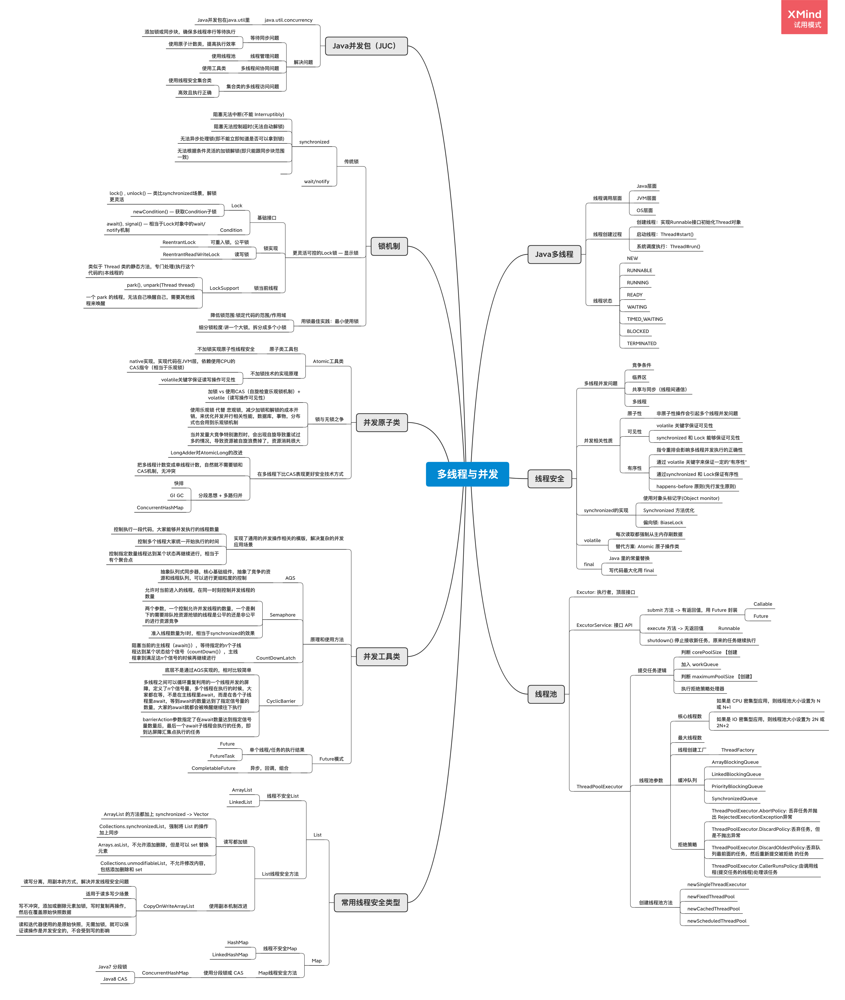

# 第四周作业

## 作业题目

**1.（选做）**把示例代码，运行一遍，思考课上相关的问题。也可以做一些比较。

**2.（必做）**思考有多少种方式，在 main 函数启动一个新线程，运行一个方法，拿到这
个方法的返回值后，退出主线程? 写出你的方法，越多越好，提交到 GitHub。
一个简单的代码参考: [ https://github.com/kimmking/JavaCourseCodes/tree/main/03concurrency/0301 ](https://github.com/kimmking/JavaCourseCodes/tree/main/03concurrency/0301)/src/main/java/java0/conc0303/Homework03.java

**3.（选做）**列举常用的并发操作 API 和工具类，简单分析其使用场景和优缺点。
**4.（选做）**请思考: 什么是并发? 什么是高并发? 实现高并发高可用系统需要考虑哪些 因素，对于这些你是怎么理解的?
**5.（选做）**请思考: 还有哪些跟并发类似 / 有关的场景和问题，有哪些可以借鉴的解决 办法。
**6.（必做）**把多线程和并发相关知识梳理一遍，画一个脑图，截图上传到 GitHub 上。 可选工具:xmind，百度脑图，wps，MindManage，或其他。

## 作业完成说明

### 作业1

> Lock相关示例
>
> 1.死锁示例（synchronized相互等待）
>
> https://github.com/piercebn/JavaCourse/blob/main/01jvm/java-cource/src/main/java/com/piercebn/javacource/concurrency/conc02/lock/LockMain.java
>
> 2.使用Lock示例（使用ReentrantLock，替换synchronized）
>
> https://github.com/piercebn/JavaCourse/blob/main/01jvm/java-cource/src/main/java/com/piercebn/javacource/concurrency/conc02/lock/ReentrantLockDemo.java
>
> 3.使用Lock示例（使用ReentrantLock，测试公平锁与非公平锁）
>
> https://github.com/piercebn/JavaCourse/blob/main/01jvm/java-cource/src/main/java/com/piercebn/javacource/concurrency/conc02/lock/ReentrantLockDemo.java
>
> 4.使用读写锁示例（使用ReentrantReadWriteLock）
>
> https://github.com/piercebn/JavaCourse/blob/main/01jvm/java-cource/src/main/java/com/piercebn/javacource/concurrency/conc02/lock/ReentrantReadWriteLockDemo.java
>
> 5.使用Condition示例（使用lock.newCondition()进行子锁进行协作控制）
>
> https://github.com/piercebn/JavaCourse/blob/main/01jvm/java-cource/src/main/java/com/piercebn/javacource/concurrency/conc02/lock/ConditionDemo.java
>
> 6.锁当前线程示例（使用LockSupport）
>
> https://github.com/piercebn/JavaCourse/blob/main/01jvm/java-cource/src/main/java/com/piercebn/javacource/concurrency/conc02/lock/LockSupportDemo.java

### 作业2

> 启动线程获取返回结果，实现10种方式
>
> 方法1：用join等待
>
> https://github.com/piercebn/JavaCourse/blob/main/01jvm/java-cource/src/main/java/com/piercebn/javacource/concurrency/Homework/Homework01.java
>
> 方法2：用wait和notify机制
>
> https://github.com/piercebn/JavaCourse/blob/main/01jvm/java-cource/src/main/java/com/piercebn/javacource/concurrency/Homework/Homework02.java
>
> 方法3：用sleep循环等待
>
> https://github.com/piercebn/JavaCourse/blob/main/01jvm/java-cource/src/main/java/com/piercebn/javacource/concurrency/Homework/Homework03.java
>
> 方法4：用线程池submit+Runnable
>
> https://github.com/piercebn/JavaCourse/blob/main/01jvm/java-cource/src/main/java/com/piercebn/javacource/concurrency/Homework/Homework04.java
>
> 方法5：用线程池submit+Callable
>
> https://github.com/piercebn/JavaCourse/blob/main/01jvm/java-cource/src/main/java/com/piercebn/javacource/concurrency/Homework/Homework05.java
>
> 方法6：用Semaphore信号量
>
> https://github.com/piercebn/JavaCourse/blob/main/01jvm/java-cource/src/main/java/com/piercebn/javacource/concurrency/Homework/Homework06.java
>
> 方法7：用CountDownLatch
>
> https://github.com/piercebn/JavaCourse/blob/main/01jvm/java-cource/src/main/java/com/piercebn/javacource/concurrency/Homework/Homework07.java
>
> 方法8：用线程池FutureTask+Callable
>
> https://github.com/piercebn/JavaCourse/blob/main/01jvm/java-cource/src/main/java/com/piercebn/javacource/concurrency/Homework/Homework08.java
>
> 方法9：用CompletableFuture+Supplier
>
> https://github.com/piercebn/JavaCourse/blob/main/01jvm/java-cource/src/main/java/com/piercebn/javacource/concurrency/Homework/Homework09.java
>
> 方法10：用Condition机制
>
> https://github.com/piercebn/JavaCourse/blob/main/01jvm/java-cource/src/main/java/com/piercebn/javacource/concurrency/Homework/Homework10.java

### 作业3

### 作业4

### 作业5

### 作业6

> 多线程和并发相关知识脑图

